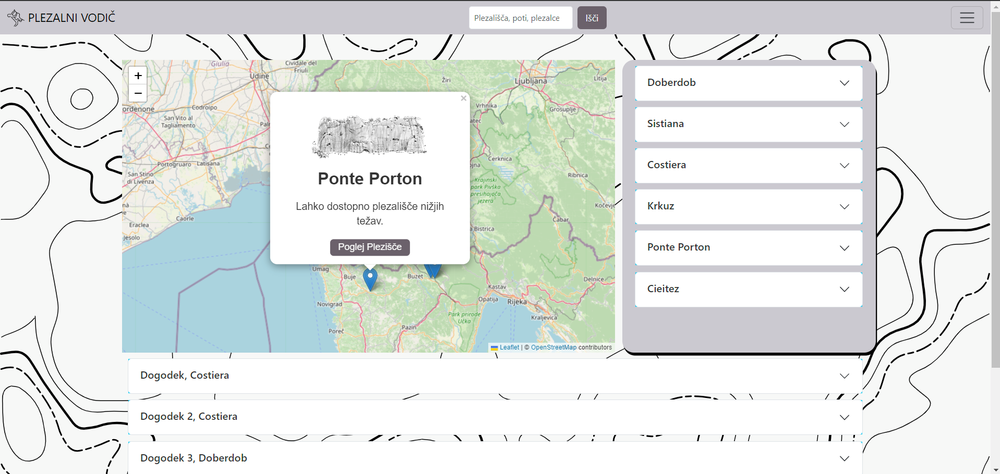
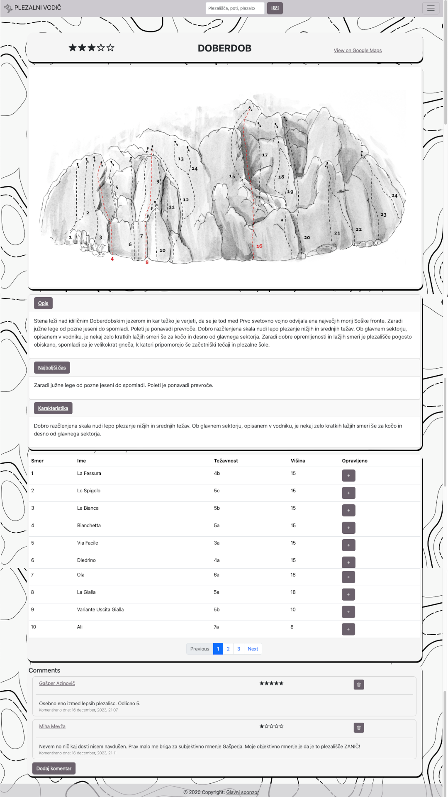
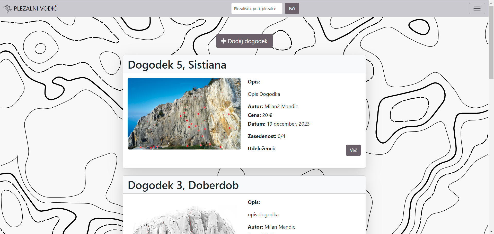
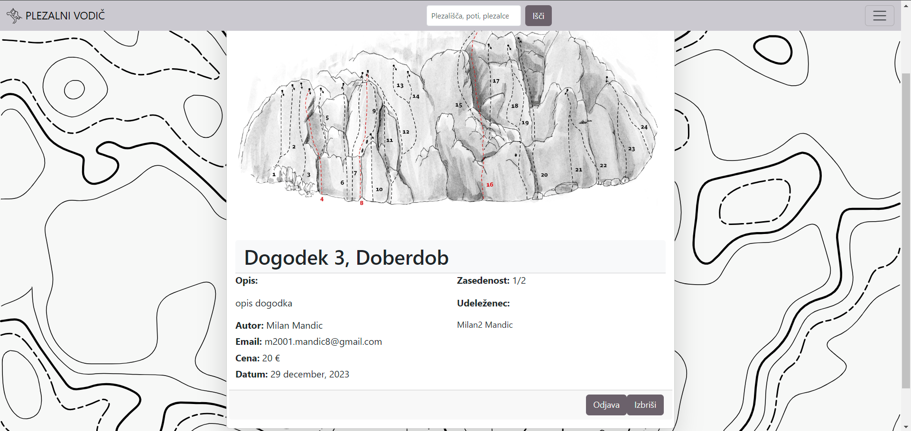
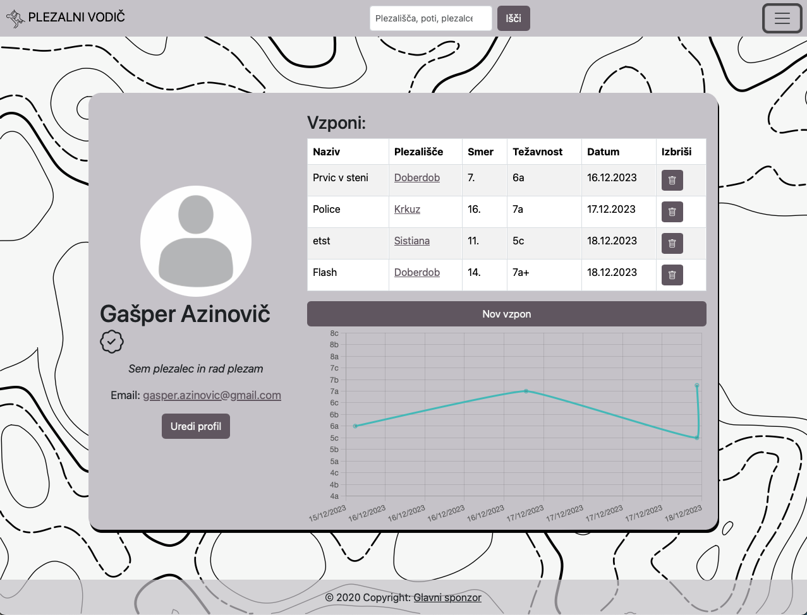
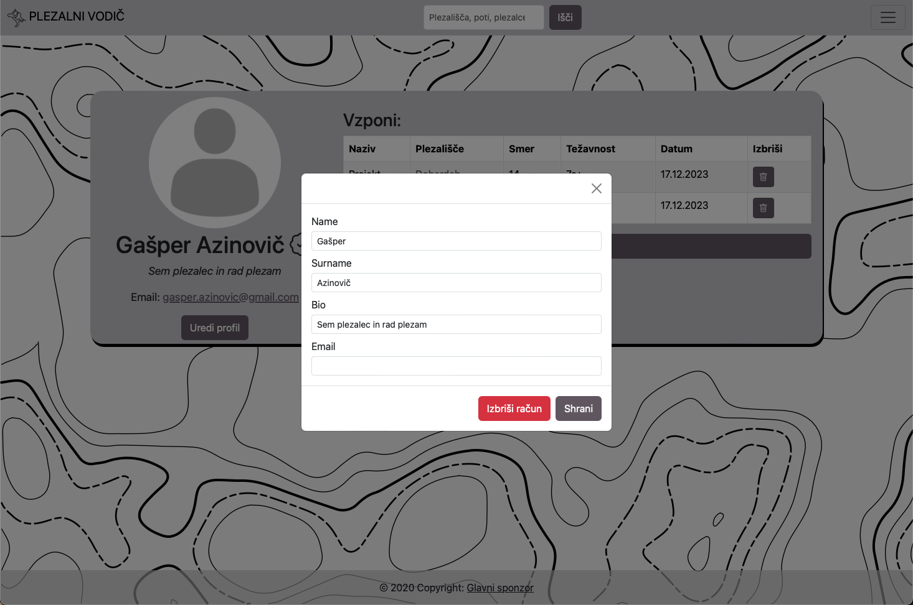

# Spletna Aplikacija Plezalni Vodič LP1

Dobrodošli v našem projektu Plezalni Vodič za predmet **Spletno Programiranje** v študijskem letu **2023/2024**. Ta spletna aplikacija deluje kot digitalni vodič po plezališčih, obogaten z interaktivnimi funkcijami in zmožnostmi.

**https://plezalni-vodic.fly.dev/**

## Ključne Funkcionalnosti

- **Iskanje na Interaktivnem Zemljevidu**: Locirajte plezališča na zemljevidu ali uporabite iskalnik.
- **Plezalni Izleti**: Udeležite se plezalnih izletov pod vodstvom certificiranih plezalcev.
- **Informacije o Plezališčih - master/detail zaslonska maska**: Vsako plezališče vključuje slike, ocene, lokacije, najboljše čase za plezanje in značilnosti plezališč.
- **Vključevanje Uporabnikov**: Registrirani uporabniki lahko ocenjujejo, komentirajo in beležijo svoje vzpone.
- **Upravljanje Profila**: Uporabniki lahko vidijo svoje preplezane smeri, dodajajo nove in urejajo svoje profile.

## Posnetki Zaslona

| Domača Stran | Plezališče | Dogodki |
|:------------:|:----------:|:-------:|
|  |  |  |

| Več o dogodku | Profil | Uredi Profil |
|:------------:|:------:|:------------:|
|  |  |  |

## Vrste Uporabnikov

- **Neregistriran Uporabnik**: Ogled plezališč, komentarjev in dogodkov.
- **Registriran Uporabnik**: Komentiranje, prijave na dogodke in beleženje vzponov.
- **Vodič(admin)**: Ustvarjanje in upravljanje dogodkov.

## Razvojna Ekipa

Spoznajte ekipo, ki stoji za projektom, in naše podporne mentorje.

- **Mentorja**: Izr. prof. dr. Dejan Lavbič, Sandi Gec
- **Razvijalci**: [Informacije o ekipi](./readmePics/oNas.png)

## Testni Računi

Za testiranje uporabite naslednje poverilnice:

- **Vodiči**: 
  - Email: user1@gotmail.com | Geslo: user123
  - Email: user2@gotmail.com | Geslo: user123
- **Redni Uporabniki**: 
  - Email: user4@gotmail.com | Geslo: user123

## Tehnične Specifikacije

- **Regex za Preverjanje Gesel**:
  - Email: `^[a-zA-Z0-9._%+-]+@[a-zA-Z0-9.-]+\.[a-zA-Z]{2,}$`
  - Geslo: `^(?=.*[a-z])(?=.*[A-Z])(?=.*\d).{6,}$`
- **Ostali Regex Vzorci**: Ime, Cena
- **Vključene Značilnosti**: Potrditev preko e-pošte, grafikoni, zemljevidi, modalna okna, komentiranje, beleženje smeri.

## Združljivost z Brskalniki

Združljivo s Firefoxom, Chromom in Safarjem brez opaznih razlik.

## Zagon Aplikacije

1. Klonirajte repozitorij: `git clone`.
2. Premaknite se v mapo repozitorija.
3. Prepričajte se, da `docker-compose.yml` vsebuje storitev `node-api`.
4. Standardna Dockerfile slika: `16-alpine`.
5. Zaženite aplikacijo in MongoDB: `docker-compose up`.
6. Dostop do aplikacije na `http://localhost:3000`.
7. Za ustavitev uporabite `CTRL+C` in `docker-compose down`.

## Moduli

- **NodeMailer**: Za pošiljanje e-pošte, vključno z HTML vsebinami in prilogami.
- **Bcrypt**: Za varno hranjenje gesel z uporabo hash funkcij in saltinga.

# Decentralizirana aplikacija na verigi blokov LP2

Nadgrajeni zaslonski maski sta Dogodki in Več o dogodku. Prva omogoča ustvarjanje dogodkov administratorju na verigi blokov, druga pa omogoča kupovanje vstopnice registriranim uporabnikom s kriptovaluto ETH. Administrator lahko prevzame izkupiček sredstev prijav v dogodek. Po preteku dogodka, lahko administrator dogodek izbriše.

## MetaMask
Klik na stran dogodki, od uporabnika zahteva prijavo z MetaMask denarnico.

## Posodobitev podatkovne baze
Ob registraciji lahko uporabnik doda svoj javni ključ za denarnico, ki je tudi prikazana na profilu. 
## Zunanja knjižnica - Open Zeppelin
Knjižnico OpenZeppelin SafeMath smo uporabili za varno matematično operacijo pri konverziji valut.
## Branje podatkov izven verige - ChainLink
Uporaba Chainlink Oracle prek vmesnika (interface) za pridobivanje najnovejšega odgovora o menjalnem tečaju, ki ga določa naslov Oracle.
## Potrebni podatki za zagon na zasebni verigi blokov
1. V MetaMasku dodaj testno omrežje Ganache RPC URL = HTTP://127.0.0.1:7545 in CHAIN ID = 1337.
2. Uvozi privatne ključe v metamask.
3. Izvedi truffle migrate.
4. Kopiraj contract adress od TicketingSystem v environment.
5. Pri uporabi testnih uporabnikov dodaj ETH javni naslov v profil.